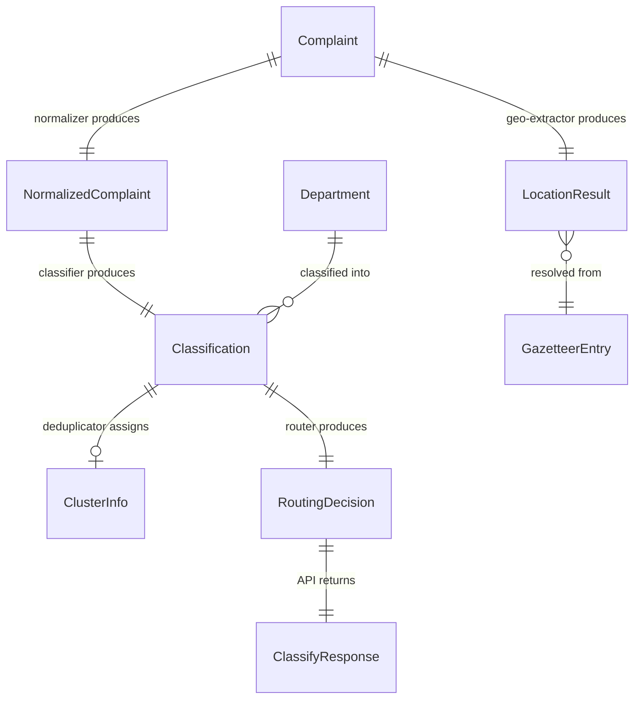
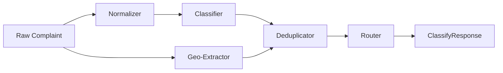

# Data Model: NaqsKAR — AI Complaint Triage & Routing API

**Phase**: 1 — Design & Contracts
**Date**: 2026-05-20

## Entity Relationship Diagram

## Core Entities

### Complaint (Input)

The raw citizen complaint as received from any intake channel.

| Field | Type | Required | Description |
|-------|------|----------|-------------|
| text | string | ✅ | Raw complaint text (Roman Urdu, Urdu script, English, or code-mixed). Min 3 chars, max 5000 chars. |
| language | string (enum) | ❌ | Optional hint: `roman_urdu`, `urdu`, `english`, `mixed`. Auto-detected if omitted. |
| user_id | string | ❌ | Optional caller/citizen identifier for tracking. |
| timestamp | datetime | ❌ | When the complaint was filed. Defaults to server time if omitted. |
| location_hint | string | ❌ | Optional pre-extracted location (e.g., from a form field). |

**Validation rules**:
- `text` MUST be non-empty and between 3–5000 characters.
- `language` if provided MUST be one of the enum values.
- `user_id` if provided MUST be ≤ 128 characters.

---

### NormalizedComplaint (Internal)

The output of the Multilingual Normalizer module. Not exposed via API — internal contract between normalizer and classifier.

| Field | Type | Required | Description |
|-------|------|----------|-------------|
| original_text | string | ✅ | The raw input text, preserved for audit. |
| normalized_text | string | ✅ | Text converted to a normalized representation (English-ish intent). |
| detected_language | string | ✅ | Detected language: `roman_urdu`, `urdu`, `english`, `mixed`. |
| extracted_intent | string | ✅ | High-level intent keyword (e.g., `water_supply_outage`). |
| extracted_entities | dict | ✅ | Key entities: duration, affected_area, severity_keywords, etc. |
| confidence | float | ✅ | Normalization confidence (0.0–1.0). |

---

### Classification (Internal → exposed in response)

The output of the Multi-Label Classifier module.

| Field | Type | Required | Description |
|-------|------|----------|-------------|
| department | string | ✅ | Primary department (from Department taxonomy). |
| sub_category | string | ✅ | Sub-category within the department (e.g., `outage`, `billing`, `quality`). |
| urgency_score | float | ✅ | Urgency on 0.0–1.0 scale. ≥0.8 for critical keywords. |
| sentiment | string | ✅ | One of: `positive`, `negative`, `neutral`. |
| confidence | float | ✅ | Classification confidence (0.0–1.0). |
| urgency_keywords_matched | list[string] | ❌ | Any urgency keywords found (e.g., `["hospital", "baccha"]`). |

**State transitions**: None — Classification is immutable once produced.

---

### LocationResult (Internal → exposed in response)

The output of the Geo-Extractor module.

| Field | Type | Required | Description |
|-------|------|----------|-------------|
| raw_location | string | ✅ | The location entity as extracted from text. |
| resolved_name | string | ✅ | Canonical location name (e.g., "G-9, Islamabad"). |
| latitude | float | ❌ | Resolved latitude. Null if resolution failed. |
| longitude | float | ❌ | Resolved longitude. Null if resolution failed. |
| confidence | float | ✅ | Geo-resolution confidence (0.0–1.0). <0.5 = uncertain. |
| source | string | ✅ | Resolution source: `gazetteer`, `llm_fallback`, `none`. |
| city | string | ❌ | City name if resolved. |

---

### ClusterInfo (Internal → exposed in response)

The output of the Semantic Deduplication module.

| Field | Type | Required | Description |
|-------|------|----------|-------------|
| cluster_id | string | ❌ | Cluster identifier (e.g., `cluster_2026_05_water_001`). Null if dedup unavailable. |
| is_duplicate | boolean | ✅ | Whether this complaint matched an existing cluster. |
| cluster_size | integer | ❌ | Number of complaints in the cluster. |
| cluster_weight | float | ❌ | Computed severity: `count × average_urgency`. |
| similarity_score | float | ❌ | Cosine similarity to cluster centroid (0.0–1.0). |

---

### RoutingDecision (Internal → exposed in response)

The final output combining all module results into a routing recommendation.

| Field | Type | Required | Description |
|-------|------|----------|-------------|
| department | string | ✅ | Target department for routing. |
| sub_department | string | ✅ | Sub-category for more specific routing. |
| urgency_score | float | ✅ | Final urgency score (may be boosted by keywords). |
| location | LocationResult | ❌ | Resolved location (null if no location found in text). |
| cluster | ClusterInfo | ❌ | Cluster assignment (null if dedup unavailable). |
| suggested_response_urdu | string | ✅ | Auto-generated Urdu response template. |

---

### Department (Reference Data)

Static reference data loaded from `data/departments.json`.

| Field | Type | Required | Description |
|-------|------|----------|-------------|
| id | string | ✅ | Machine-readable ID (e.g., `water_supply`). |
| name_en | string | ✅ | English display name. |
| name_ur | string | ✅ | Urdu display name. |
| sub_categories | list[string] | ✅ | Valid sub-categories. |
| response_template_ur | string | ✅ | Default Urdu acknowledgment template. |

---

### GazetteerEntry (Reference Data)

Static reference data loaded from `data/pakistan_gazetteer.json`.

| Field | Type | Required | Description |
|-------|------|----------|-------------|
| name | string | ✅ | Canonical name (e.g., "G-9"). |
| aliases | list[string] | ✅ | Common misspellings and alternate forms. |
| city | string | ✅ | Parent city. |
| latitude | float | ✅ | Latitude coordinate. |
| longitude | float | ✅ | Longitude coordinate. |

---

### AnalyticsSummary (API Response)

Aggregated analytics data for the dashboard and API consumers.

| Field | Type | Required | Description |
|-------|------|----------|-------------|
| region | string | ✅ | Queried region filter. |
| period_days | integer | ✅ | Time window in days. |
| total_complaints | integer | ✅ | Total complaints in the window. |
| by_department | dict[string, int] | ✅ | Complaint count per department. |
| by_urgency | dict[string, int] | ✅ | Count by urgency band (low/medium/high/critical). |
| avg_urgency | float | ✅ | Average urgency score across all complaints. |
| clusters | list[ClusterSummary] | ✅ | Active clusters with coordinates. |

### ClusterSummary (Nested in AnalyticsSummary)

| Field | Type | Required | Description |
|-------|------|----------|-------------|
| cluster_id | string | ✅ | Cluster identifier. |
| department | string | ✅ | Primary department of the cluster. |
| complaint_count | integer | ✅ | Number of complaints in cluster. |
| weight | float | ✅ | Severity weight. |
| latitude | float | ✅ | Cluster centroid latitude. |
| longitude | float | ✅ | Cluster centroid longitude. |
| representative_text | string | ✅ | Most representative complaint text. |

## Module Dependency Graph

**Key constraint** (Constitution II): Normalizer, Classifier, Geo-Extractor, and Deduplicator MUST NOT import from each other. All data flows through the Orchestrator Pipeline, which calls each module sequentially or in parallel as shown above.
